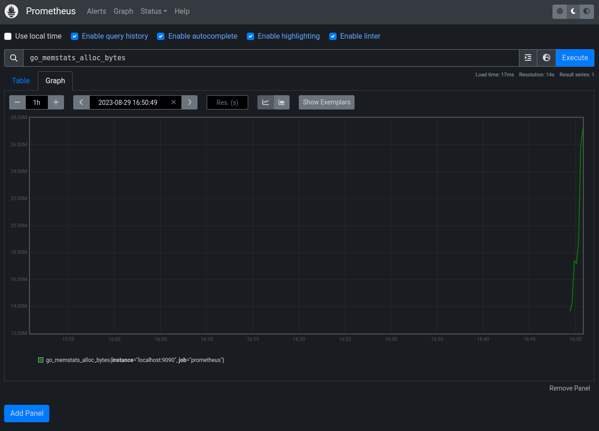
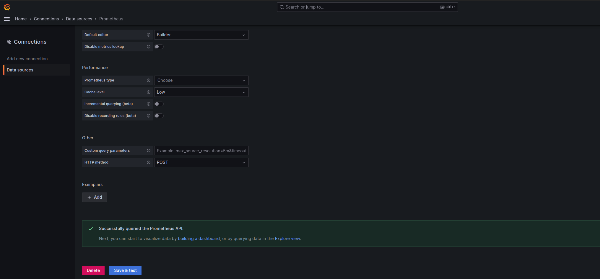
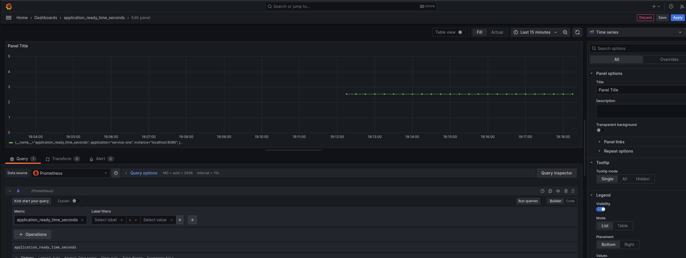
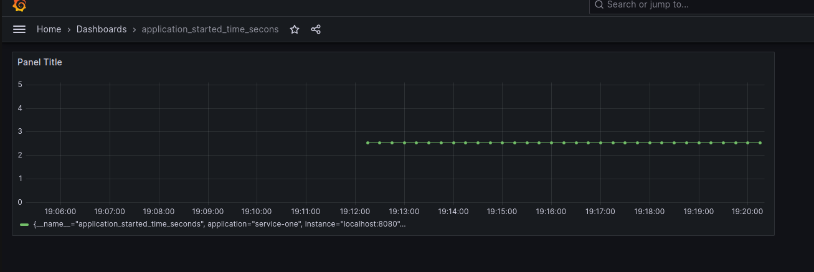
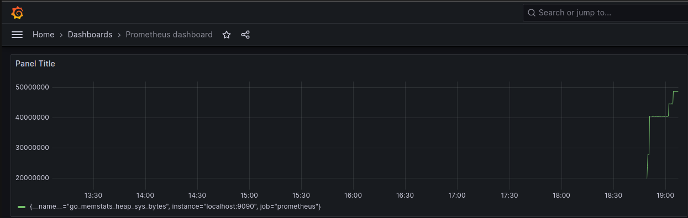
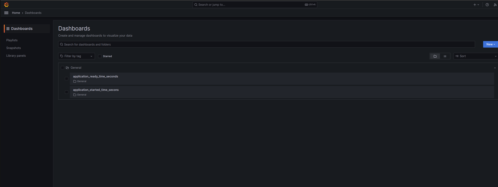

# service-monitor
Monitoring (Prometheus) and visualizing metrics (Grafana) services (service-one, service-two) in Springboot.

## Technology stack
- Java 11
- Maven
- Springboot, spring actuator
- Docker, Docker Compose
- Prometheus
- Grafana

## How to run the app?
- In root directory run docker compose file for Grafana and Prometheus: docker-compose -f docker-compose.yml up -d
- run Springboot services:
  - service-two
  - service-one

## How does it work?
when calling service-one from the client, it will call service-two and return its response.
Prometheus is monitoring on its dashboard, Grafana is used to show metrics, through Prometheus & Spring Actuator,
which is configured in prometheus.yml file. Prometheus is configured into service-one. In Grafana, Prometheus is then
configured as a datasource, from which Grafana shows graphs. So how can you test it? 
- run docker with Grafana, Prometheus and services (service-one, service-two)
- make a few requests on service-one /first-service/greeting
- open http://localhost:8080/actuator/prometheus
- select a metric you want to visualize in Grafana, for example: http_server_requests_seconds_bucket 
(http_server_requests_seconds_bucket{application="service-one",exception="None",method="GET",outcome="SERVER_ERROR",status="500",uri="/first-service/greeting",le="0.001",} 0.0)
- Go to Grafana, new dashboard, select your configured datasource (prometheus), add a metric name http_server_requests_seconds_bucket
and click run query

## Services & Tools
### service-one:
- Accessible on: http://localhost:8080
- endpoint: 
  - (GET) /first-service/greeting
  - params: serviceName
  - success response: 200
  - error response: 500
  - calls service-one: http://localhost:8081/second-service/greeting?serviceName=test

### service-two:
- Accessible on: http://localhost:8081
- endpoint:
  - (GET) /second-service/greeting
  - params: serviceName
  - it randomly (50% chance) returns internal server error for the sake of Prometheus monitoring.

### Springboot actuator
- http://localhost:8080/actuator
- http://localhost:8080/actuator/health
- http://localhost:8080/actuator/metrics
- http://localhost:8080/actuator/configprops
- http://localhost:8080/actuator/env

### Prometheus
- app monitoring
- accessible on: http://localhost:9090/

### Grafana
- app metrics
- accessible on: http://localhost:3000/login
- user: admin, pass: admin (you need to change it at first login)

### Loki
- application logging
- accessible on: http://localhost:3100

## Showcase

